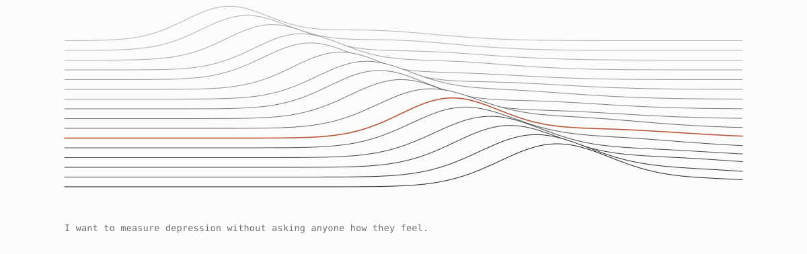

<picture>
  <source media="(prefers-color-scheme: dark)" srcset="header-dark.svg">
  
</picture>

Economics from UW–Madison, May 2026. Machine learning evaluation, quantitative
finance and healthcare analytics.

Write-ups with figures live at [abhaymettu.com/research](https://www.abhaymettu.com/research/).

### Machine learning systems

| | |
|---|---|
| [judge-reliability](https://github.com/abhaymettu/judge-reliability) | An LLM judge agrees with the human majority 85.5% of the time against an 88.2% human ceiling, and only 14.9 points above a rule that reads none of the text and picks the longer answer. |
| [retrieval-ablation](https://github.com/abhaymettu/retrieval-ablation) | Hybrid retrieval beats BM25 by 0.204 nDCG@10 on fiqa. A cross encoder over the top 100 makes all three BEIR datasets worse, and Recall@100 caps what any reranker could recover. |
| [drift-guard](https://github.com/abhaymettu/drift-guard) | Four drift detectors scored on detection delay against false alarm rate. The automatic rollback fires on schedule and costs a further 0.0615 AUC, because it falls back to another pre-shift model. |

### Quantitative finance

| | |
|---|---|
| [factor-haircut](https://github.com/abhaymettu/factor-haircut) | Eight price and volume factors. One clears a costless t of 2.0 and none survive a multiple testing haircut. Momentum breaks even at 199 bps, 20x the headline cost, so it fails on significance rather than on cost. |
| [vol-horserace](https://github.com/abhaymettu/vol-horserace) | Gradient boosting beats HAR-RV on QLIKE at a one day horizon and is thrown out of the 90% model confidence set at 22 days. |
| [kalshi-calibration](https://github.com/abhaymettu/kalshi-calibration) | Kalshi prices are calibrated. What a naive backtest reads as edge is 65% bid-ask spread, and fees consume 86% of what survives. |

### Real estate and markets

| | |
|---|---|
| [assessment-regressivity](https://github.com/abhaymettu/assessment-regressivity) | 39.6% of Dane County sales closing before the lien date carry an assessed value equal to the sale price to the dollar, against 1.0% after it. The obvious hedonic control is a trap that moves the regressivity estimate from -0.113 to -0.413; the uncontaminated one leaves -0.0626. |
| [comps-error](https://github.com/abhaymettu/comps-error) | Comparable-sales valuation misses by 19.4% at the median on 168,178 held-out New York sales, and loses to the market value the city publishes for free at 17.7%. Estimates were committed before the scoring code existed. |
| [permit-lifecycle](https://github.com/abhaymettu/permit-lifecycle) | Permit to completion runs 7 months for a single house and 23 for a 50-unit project, so there is no single lag. The never-built share does not generalise at all, 0.9% to 9.4% across six cities. |

### Commercial and category analytics

| | |
|---|---|
| [energy-category-share-shift](https://github.com/abhaymettu/energy-category-share-shift) | Category share from two issuers' SEC scanner exhibits. Cross-issuer disagreement is 2.16 share points, larger than most published shifts. |
| [energy-category-forecast](https://github.com/abhaymettu/energy-category-forecast) | A driver-based share forecast that lost to a no-change baseline on backtest, so the scenario range shipped instead of a point estimate. |

### Healthcare and payer analytics

| | |
|---|---|
| [msdrg-severity-capture](https://github.com/abhaymettu/msdrg-severity-capture) | Severity coding screened across 2,906 hospitals. The same code flags 1,000 hospitals or 70 depending on one defensible choice about suppressed cells, so the public file cannot settle it. |
| [hospital-margin-variance](https://github.com/abhaymettu/hospital-margin-variance) | Payer mix is the smallest of six drivers of hospital operating margin, and 68.7% of the variation is not explained by any of them. |
| [cms-inpatient-warehouse](https://github.com/abhaymettu/cms-inpatient-warehouse) | DuckDB star schema over 292,306 Medicare discharges, with a 35-check test suite proved by injecting faults rather than by passing. |
| [ncd-310-coverage-engine](https://github.com/abhaymettu/ncd-310-coverage-engine) | Medicare NCD 310.1 as a testable rules engine over 8,131 trials. 75% are undecidable from public fields, and that is the finding. |
| [clinic-overbooking-policy](https://github.com/abhaymettu/clinic-overbooking-policy) | A no-show model beats a flat rule by 0.4 clinician minutes, and does worse than no model once calibration drifts with AUC unchanged. |
| [ehr-data-quality-harness](https://github.com/abhaymettu/ehr-data-quality-harness) | 20 of 24 data quality checks fire zero times on clean data, so the deliverable is the fault injection that scores the scorecard. |
| [trial-budget-variance](https://github.com/abhaymettu/trial-budget-variance) | Price-volume-mix bridge on CMS fee schedules. 89% of a $99,498 gap is enrolment volume, and the five components reconcile exactly. |
| [brfss-vs-places](https://github.com/abhaymettu/brfss-vs-places) | CDC PLACES reproduces about 75% of the true between-area variance in the direct BRFSS estimate, so it ranks areas well and understates every gap. The thin-sample explanation does not hold: the compression is there at every area size. |
| [clinvar-acmg-cohort](https://github.com/abhaymettu/clinvar-acmg-cohort) | ACMG reportable variants over 9M ClinVar rows. Only 3.9% have a usable frequency, so every prevalence is a lower bound. |

### Psychology and population health

| | |
|---|---|
| [reddit-selfdistance](https://github.com/abhaymettu/reddit-selfdistance) | Preregistered. One of two dictionaries missed its own validation threshold, so the hypothesis resting on it was downgraded. |
| [population-mental-health](https://github.com/abhaymettu/population-mental-health) | Cox models on MIDUS and NHANES, including a correction to a hazard ratio I first reported wrong. |
| [phq9-measurement-invariance](https://github.com/abhaymettu/phq9-measurement-invariance) | PHQ-9 invariance fails across sex on one somatic item, and about 11% of the published sex gap is the instrument rather than the people. The race verdict flips on a modelling default nobody reports. |
| [ews-mood](https://github.com/abhaymettu/ews-mood) | Critical-slowing-down indicators for mood transitions. A nominally 5% test rejected 28 to 43% under the null. |

### Engineering and tools

| | |
|---|---|
| [paper-lecture](https://github.com/abhaymettu/paper-lecture) | Turns a paper PDF into a narrated lecture and an Anki deck. Local TTS, no API keys. |
| [recap](https://github.com/abhaymettu/recap) | Records a successful computer-use agent run as a typed capability, replays it deterministically, and heals it when the UI moves. |
| [claude-desktop-to-code](https://github.com/abhaymettu/claude-desktop-to-code) | Routes work from a Claude Desktop chat into Claude Code, headless or handed to a real terminal with the session history intact. |
| [temporal-grounding](https://github.com/abhaymettu/temporal-grounding) | Claude skill that catches a date the user asserts against the date already in context. Built test first over about 40 isolated runs. |
| [writing-from-dated-sources](https://github.com/abhaymettu/writing-from-dated-sources) | Claude skill that stops a stale document being rewritten as fresh present-tense prose. Base rate measured over 613 real files. |
| **numen** | A personal assistant that lives in your texts: morning brief, Gmail replies drafted in your voice, calendar, durable memory, and a text that can start a real Claude Code session in any repo. 1,600 lines of stdlib Python, zero dependencies, running on my own Mac. Private for now, [ask for access](mailto:abhaymettu12@gmail.com?subject=numen). |

Analyst and research roles where the job is to build the number and then find
out whether it holds. Washington State, Chicago, Boston or Madison WI, and I
will move.
[abhaymettu.com](https://www.abhaymettu.com) · abhaymettu12@gmail.com
